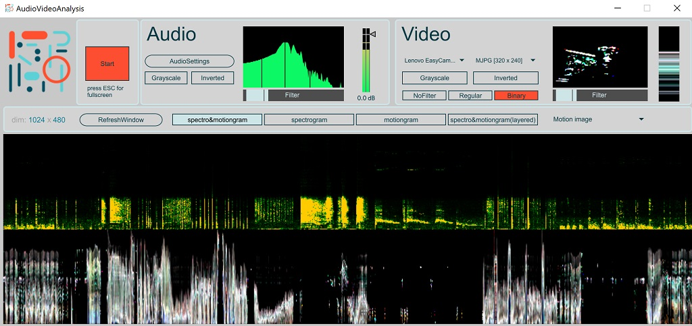

# AudioVideoAnalysis

A standalone application for realtime spectral analysis of audio and video.

## Features

This is an application for realtime analysis of audio and video. It draws a spectrogram from any connected microphone and motiongram/videogram from any connected camera.

- Draws a spectrogram from any connected microphone
- Draws a motiongram/videogram from any connected camera

## Usage

- Turn on processing
- Switch between different audio and video inputs
- Try to switch between "regular" and "motion" image for the visualization
- Toggle fullscreen mode with the escape button

## Developers

[Alexander Refsum Jensenius](http://people.uio.no/alexanje), [Aleksander Tidemann](https://github.com/AleksanderTidemann)

## Reference

If you use this toolbox for research purposes, please reference this publication:

- Jensenius, Alexander Refsum (2005). [Developing Tools for Studying Musical Gestures within the Max/MSP/Jitter Environment](https://www.duo.uio.no/handle/10852/26907). Proceedings of the International Computer Music Conference, p. 282-285.

## License

This toolbox is released under the [GNU General Public License 3.0 license](https://www.gnu.org/licenses/gpl-3.0.en.html).
